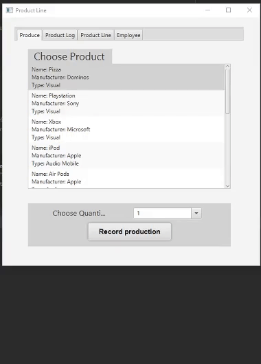
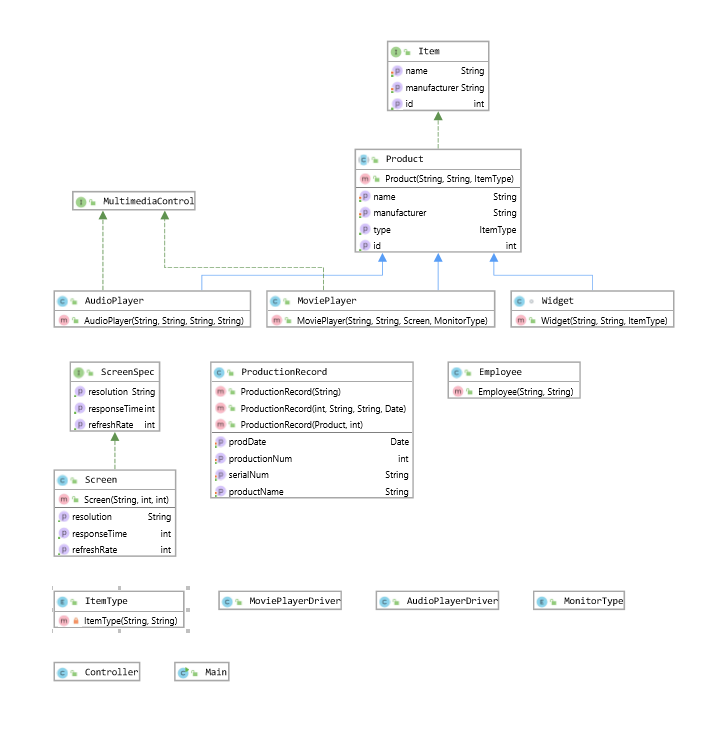
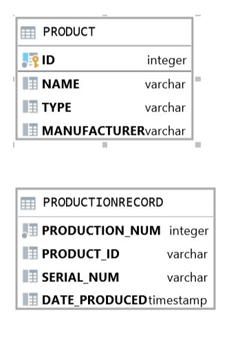

# Product Like Tracker

This JavaFX application is a way for to store information about a product into a database and use those product to store production records when a users want to order a product. Hte user is able to create a product based on the name of the product, the manufacturer of the product, and the type of product, for example, an Audio Mobile product. There is a log text area that records all of the products that were requested to be producted by the company. The record production tab list all the current products in the database and shows their name, manufacture and the item type. The user can click on the product and the amount of items they want to create to send to the production log that they want to create that number of items. 
This project is individually created by Zachary Maroney with guidance from Professor Vansellow at FLorida Gulf Coast University. 
This project was created through out the Fall semester of 2019, while Zachary Maroney was a Junior in the Software Engineering program at Florida Gulf Coast University. 
This Project was a major part of the Objective Oriented Class at Florida Gulf Coast Univeristy. 

## Demonstration

 

## Documentation

[JavaDoc](http://localhost:63342/ProductLineTracker/docs/zamaroney/github/io/package-summary.html)

## Diagrams
Java Diagram

 

 Database
 
 
 

## Getting Started

The H2 Database is is use with this projects.

The Driver is in the res folder of this project.

## Built With

* Intellij with Java8.
* Scene builder was used to create the GUI.
* Professor Vanselow's course website was used to structure the project.

## Contributing

If you fine any errors with the code please email me at zamaroney@gmail.com with any issues.

## Author

Zachary Maroney

## Acknowledgments

* https://sites.google.com/site/profvanselow/course/cop-3003/oop-project?authuser=0
* Professor Vanselow

## History

11/23/2019 - Project fully uploaded to github.